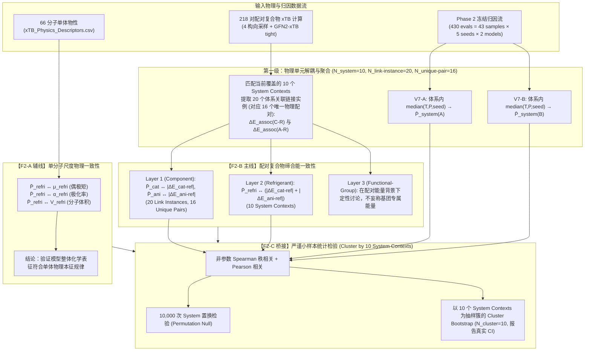

# F2 独立物理对齐系统架构与严谨统计协议 (F2 Physics Alignment Protocol - v2.2 生产前最终冻结版)

> **核心科学定位**：F2 是归因敏感度与独立微观结合强度的 **Pilot / Proof-of-Consistency 外部物理验证**。
> **五项铁律**：
> 1. 严禁伪重复（Zero Pseudoreplication）：严格以物理实体为检验单位，厘清体系上下文与物理配对身份；
> 2. 模型分轨（Decoupled A/B Tracks）：V7-A 与 V7-B 完全分轨独立计算主证据；
> 3. 严禁跨尺度直接对齐（Zero Scale Mismatch）：分层对齐无量纲份额与物理能级；
> 4. 严禁过度断言（No Overclaiming Beyond Gas-Phase Dimers）：限定为真空二聚体电子结构缔合描述符；
> 5. 过程零污染（Zero Provenance Contamination）：强制 Schema 门禁、Full-218 键集全等断言与断点续算自动剔除失败记录。

---

## 一、有效物理样本量层级解耦 (Sample Hierarchy & Epistemic Boundary)

当前 Phase 2 的 430 次 Graph-IG 归因评估在物理上绝非 430 个独立样本。其数据、体系上下文与微观物理实体之间的层级映射关系严格界定如下：

$$\boxed{\begin{aligned}
430\text{ 次随机模型评估} &\;\longrightarrow\; 43\text{ 个实验工况点样本} \\
&\;\longrightarrow\; \mathbf{N_{\mathrm{system}} = 10\text{ 个唯一 IL–制冷剂三元体系上下文 (Unique System Contexts)}} \\
&\;\longrightarrow\; \mathbf{N_{\mathrm{link-instance}} = 20\text{ 个体系关联的 C–R/A–R 链接实例 (System-Linked Link Instances)}} \\
&\;\longrightarrow\; \mathbf{N_{\mathrm{unique\ pairwise}} = 16\text{ 个去重后的唯一离子–制冷剂物理身份 (Unique Pair Identities)}}
\end{aligned}}$$

全量 xTB 配对优化生产池：
$$\mathbf{N_{\mathrm{xTB}} = 218\text{ 对离子–制冷剂复合物 (125 阴离子–制冷剂 + 93 阳离子–制冷剂)}}$$

---

### 1. 核心 10 个三元体系上下文（$N_{\text{system}} = 10$）与 20 个关联链接实例（$N_{\text{link-instance}} = 20$）

每一个三元体系上下文均严格包含 1 个阳离子–制冷剂链接实例（C–R）和 1 个阴离子–制冷剂链接实例（A–R）：

| 序号 | 三元体系上下文 (System Context, $N_{\text{system}}=10$) | 阳离子–制冷剂链接实例 (C–R) | 阴离子–制冷剂链接实例 (A–R) | 对应唯一物理配对 ID (C-R / A-R) | 对应 Phase 2 工况样本数 |
| :---: | :--- | :--- | :--- | :---: | :---: |
| 1 | `[emim] + [Ac] + R1234yf` | `[emim] — R1234yf` | `[Ac] — R1234yf` | Pair C1 / Pair A1 | 5 |
| 2 | `[emim] + [BF4] + R1234yf` | `[emim] — R1234yf` | `[BF4] — R1234yf` | Pair C1 / Pair A2 | 5 |
| 3 | `[bmim] + [Ac] + R1234yf` | `[bmim] — R1234yf` | `[Ac] — R1234yf` | Pair C2 / Pair A1 | 5 |
| 4 | `[bmim] + [PF6] + R1234yf` | `[bmim] — R1234yf` | `[PF6] — R1234yf` | Pair C2 / Pair A3 | 5 |
| 5 | `[emim] + [BEI] + R134` | `[emim] — R134` | `[BEI] — R134` | Pair C3 / Pair A4 | 4 |
| 6 | `[emim] + [BEI] + R134a` | `[emim] — R134a` | `[BEI] — R134a` | Pair C4 / Pair A5 | 4 |
| 7 | `[bmim] + [BF4] + R32` | `[bmim] — R32` | `[BF4] — R32` | Pair C5 / Pair A6 | 4 |
| 8 | `[bmim] + [PF6] + R32` | `[bmim] — R32` | `[PF6] — R32` | Pair C5 / Pair A7 | 4 |
| 9 | `[emim] + [Tf2N] + R1336mzz(E)` | `[emim] — R1336mzz(E)` | `[Tf2N] — R1336mzz(E)` | Pair C6 / Pair A8 | 3 |
| 10 | `[emim] + [Tf2N] + R1336mzz(Z)` | `[emim] — R1336mzz(Z)` | `[Tf2N] — R1336mzz(Z)` | Pair C7 / Pair A9 | 4 |
| **总计** | **10 个体系上下文** | **10 条 C–R 链接实例** | **10 条 A–R 链接实例** | **7 个 C-R 对 + 9 个 A-R 对 = 16 唯一对** | **43 个工况样本 (430 次评估)** |

---

### 2. 16 个去重后的唯一离子–制冷剂物理身份（$N_{\text{unique-pair}} = 16$）

将 20 个关联链接实例按 `(Ion, Refrigerant)` 物理配对身份去重后，得到精确的 **16 个唯一物理配对**：

#### 阳离子–制冷剂配对（7 个 Unique C–R Pairs）:
1. `Pair C1`: `[emim] — R1234yf`（跨体系复用：见于体系 1, 2）
2. `Pair C2`: `[bmim] — R1234yf`（跨体系复用：见于体系 3, 4）
3. `Pair C3`: `[emim] — R134`（见于体系 5）
4. `Pair C4`: `[emim] — R134a`（见于体系 6）
5. `Pair C5`: `[bmim] — R32`（跨体系复用：见于体系 7, 8）
6. `Pair C6`: `[emim] — R1336mzz(E)`（见于体系 9）
7. `Pair C7`: `[emim] — R1336mzz(Z)`（见于体系 10）

#### 阴离子–制冷剂配对（9 个 Unique A–R Pairs）:
1. `Pair A1`: `[Ac] — R1234yf`（跨体系复用：见于体系 1, 3）
2. `Pair A2`: `[BF4] — R1234yf`（见于体系 2）
3. `Pair A3`: `[PF6] — R1234yf`（见于体系 4）
4. `Pair A4`: `[BEI] — R134`（见于体系 5）
5. `Pair A5`: `[BEI] — R134a`（见于体系 6）
6. `Pair A6`: `[BF4] — R32`（见于体系 7）
7. `Pair A7`: `[PF6] — R32`（见于体系 8）
8. `Pair A8`: `[Tf2N] — R1336mzz(E)`（见于体系 9）
9. `Pair A9`: `[Tf2N] — R1336mzz(Z)`（见于体系 10）

---

### 3. 区分 20 Link Instances 与 16 Unique Pairs 的核心科学意义

1. **单体能级与体系归因的根本解耦**：
   - **量子化学物理值**：在 GFN2-xTB 计算中，双分子二聚体（如 `[emim]—R1234yf`）处于孤立气相，具有唯一的物理缔合能 $\Delta E_{\mathrm{assoc}}$；
   - **GNN 局域归因敏感度**：在模型预测中，`[emim]` 的归因敏感度 $\bar{P}_{\mathrm{cat}}$ 是在宿主三元体系图上下文（System Context）中输出的。在体系 1（`[emim]+[Ac]+R1234yf`）中，`[emim]` 与强配位阴离子共存；在体系 2（`[emim]+[BF4]+R1234yf`）中与弱配位阴离子共存，因此模型分配给 `[emim]` 的归因份额在两个体系中是不同的观测实例。
   - **结论**：这 20 个数据点本质上是 **“受宿主体系上下文调制的 20 个关联链接观测实例 (System-Linked Link Instances)”**，而不能混淆为“20 个完全独立的物理二聚体”。
2. **为什么抽样簇必须严格绑定为 $N_{\mathrm{cluster}} = 10$ 个三元体系上下文**：
   - 若在 Layer 1（$\bar{P}_{\mathrm{cat}} \leftrightarrow |\Delta E_{\mathrm{cat-ref}}|$ 与 $\bar{P}_{\mathrm{ani}} \leftrightarrow |\Delta E_{\mathrm{ani-ref}}|$）中直接按 $N=20$ 进行自由度检验，将因 xTB 能量被复用（如 `[emim]—R1234yf` 被用两次）以及体系内 C–R 与 A–R 之间的物理耦合而造成双重伪重复；
   - 因此，**Cluster Bootstrap 的抽样簇严格定义为 $N_{\mathrm{cluster}} = 10$ 个三元体系上下文**：每次重采样以整个三元体系为不可分割单元进行重抽样并重算统计量。这不仅保留了体系内阴阳离子的物理配比约束，更完全忠实于微观物理实体的拓扑重叠关系。
3. **统计认知边界声明**：
   - 现阶段 $N_{\mathrm{system}}=10, N_{\mathrm{link-instance}}=20, N_{\mathrm{unique-pair}}=16$ 严格属于概念验证性物理一致性检验（Pilot Validation）；
   - 宽置信区间是小样本物理实体的客观反映，论文中应如实披露，展现顶尖学术诚实度。

---

## 二、六项核心协议口径冻结 (Locked Methodological Definitions)

| 协议维度 | 主分析规程 (Primary Protocol) | 敏感性/次级规程 (Sensitivity / Exploratory) | 科学与方法学理由 |
| :--- | :--- | :--- | :--- |
| **1. 物理分析单位** | **$N_{\text{system}} = 10$** 体系上下文 / **$N_{\text{link-instance}} = 20$** 链接实例 / **$N_{\text{unique-pair}} = 16$** 唯一配对 | 全数据集 218 对作为背景物理能量分布 | 严格对齐物理实体与体系上下文，消除工况与随机种子造成的自由度虚增。 |
| **2. 模型分轨** | **V7-A 与 V7-B 完全分轨独立评估**：<br>$\bar{P}_g^A \leftrightarrow \text{xTB}$ 与 $\bar{P}_g^B \leftrightarrow \text{xTB}$为主证据；池化 $\bar{P}_g^{A+B}$ 仅作次级探索。 | 比较 A/B 模型在物理对齐度上的异同 | Phase 2 已证实 A/B 在保真度与稳定性上具有异质性，跨模型粗暴平均会洗平结构特异性。 |
| **3. 工况聚合方式** | **体系/链接内中位数聚合**：<br>$\bar{P}_{\text{pair}} = \operatorname{median}_{T,P,\text{seed}}(P_{\text{sample}})$ | 配对内均值聚合 $\operatorname{mean}$ | 归因份额存在厚尾和局部极值，中位数具有更强的抗噪性与统计稳健性。 |
| **4. 制冷剂总能量** | **组合相互作用强度描述符 (求和)**：<br>$E_{\text{pair,strength}} = \|\Delta E_{\text{cat-ref}}\| + \|\Delta E_{\text{ani-ref}}\|$ | 极值判据敏感性：<br>$\max(\|\Delta E_{\text{cat-ref}}\|, \|\Delta E_{\text{ani-ref}}\|)$ | 明确术语为 `combined pairwise interaction-strength descriptor`（而非三体复合物真实结合能），求和物理意义明确。 |
| **5. F2-A 描述符尺度** | **严格限定为单分子尺度物性**：<br>$P_{\text{refri}} \leftrightarrow \mu_{\text{refri}}, \alpha_{\text{refri}}, V_{\text{refri}}$ | 离子整体偶极矩与极化率 | 现有数据仅有全分子量子描述符，严禁外推断言“官能团本征量子化学描述符”。 |
| **6. 统计假设检验** | **Spearman $\rho$ / Pearson $r$ + 10,000 次置换检验 + 以 10 个体系为簇的 Cluster Bootstrap** | 报告经验 $p$ 值与 Cluster Bootstrap 置信区间 | **抽样簇严格定义为 10 个三元体系上下文 ($N_{\text{cluster}}=10$)**，完整保留同一体系内 C–R 与 A–R 之间的物理耦合以及跨体系物理配对身份的重叠性。 |

---

## 三、代码级三道防伪与熔断门禁 (Code-Level Fail-Safe Gates)

### Gate 1: Output Schema Gate (杜绝字段混杂与数据污染)
在 `compute_full_pair_interaction_xtb.py` 中预设 27 列标准字段表 (v2.0 Schema)：
```python
EXPECTED_COLUMNS = [
    'Pair_Type', 'Ion_Name', 'Refrigerant',
    'Delta_E_assoc_kcal_mol', 'Delta_E_int_kcal_mol',
    'd_min_Angstrom', 'Best_Orientation', 'N_Converged_Orientations',
    'E_complex_Eh', 'E_ion_Eh', 'E_ref_Eh',
    'E_ori1_Eh', 'converged_ori1', 'd_min_ori1_Angstrom',
    'E_ori2_Eh', 'converged_ori2', 'd_min_ori2_Angstrom',
    'E_ori3_Eh', 'converged_ori3', 'd_min_ori3_Angstrom',
    'E_ori4_Eh', 'converged_ori4', 'd_min_ori4_Angstrom',
    'energy_selection_criterion', 'physical_definition',
    'monomer_conformer_protocol', 'Status'
]
```
若已有 `full_pair_interaction_results.csv` 的表头与上述 27 列列表不符，程序立即抛出 `ValueError` 熔断退出，杜绝旧版字段与新版行盲目追加。

### Gate 2: Checkpoint Resume Gate (严禁“记住失败”)
断点续算逻辑仅认可：
$$\text{Status} == \text{'Success'} \;\;\land\;\; \Delta E_{\text{assoc}} \in \text{Finite} \;\;\land\;\; N_{\text{Converged\_Orientations}} \ge 1$$
若历史记录中包含未收敛（`Failed`）的行，启动时自动从历史文件中**物理剔除**并写回，保证本次运行将失败项作为未完成任务重新计算，彻底杜绝失败任务被永久跳过。

### Gate 3: Gate F2-Core Fail-Fast & Exact 218 Key Set Gate (Kaggle 门禁与键集全等熔断)
在 `run_kaggle_f2_full_pair_xtb.py` 中，计算完成后自动执行三重门禁：
1. **Full-218 键全等与去重门禁**：
   - 提取 `index_with_anion.csv` 中预期的 218 个配对键（125 Anion-Ref + 93 Cation-Ref）；
   - 产物 CSV 严禁重复键（`len(actual_keys) == len(set(actual_keys))`），若有重复立即 `RuntimeError` 熔断；
   - 产物 CSV 键集合必须与预期集合完全一致（`set(actual_keys) == expected_pairs`），若缺项或多项立即 `RuntimeError` 熔断。
2. **Core-10 唯一性断言**：
   - 遍历 Phase 2 的 10 个三元体系上下文时，强制断言 `len(match_cat) == 1` 与 `len(match_ani) == 1`，彻底杜绝静默切片或多解。
3. **Core-10 100% 收敛熔断**：
   - 若 10 个三元体系（20 条链接实例）中任何一条未收敛，立即 `RuntimeError` 熔断，严禁带病打包。

```python
if covered_systems != 10:
    raise RuntimeError(
        f"🚨 [GATE F2-CORE FAILED] Phase 2 核心 10 个体系 (20 个配对链接实例) 必须 100% 收敛！当前仅完成 {covered_systems}/10。\n"
        f"未收敛清单: {'; '.join(unconverged_reports)}\n"
        f"流程强制熔断终止，严禁带病打包！请检查对应构象优化日志。"
    )
```

---

## 四、F2 三层证据体系整体架构



---

## 五、方法学术语与物理边界严谨界定

1. **构象搜索表述**：
   * 严格统一表述为：`“lowest-energy converged structure among four sampled initial orientations”`；
   * 严禁出现 `“global energy minimum”`，防止审稿人追问构象搜索完备性；
2. **物理能量命名**：
   * 严格采用：`“Association energy relative to isolated optimized monomers (ΔE_assoc)”`；
   * 明确说明：差值包含形成二聚体时的分子几何弛豫（relaxation）与变形效应，严格属于缔合能；
3. **组合能量表述**：
   * 严格采用：`“combined pairwise interaction-strength descriptor”`；
   * 严禁称为“真实三聚体结合能”；
4. **Gate F2-X 单体参考构象协议**：
   * 明确标注：`deterministic single-conformer monomer reference (ETKDGv3 seed=42 + MMFF/UFF + GFN2-xTB tight)`；
5. **与宏观热力学相平衡的边界**：
   * 明确 $\Delta E_{\text{assoc}}$ 属于气相双分子电子结构缔合描述符；
   * 绝不声称“证明模型学到了宏观热力学机理”（宏观溶解度还依赖构型熵、溶剂集体配位结构与活度系数）；
   * 命题严格定位于：**“模型局域相互作用归因敏感度是否与独立的微观量子化学配对结合强度呈现单调物理一致性”**。
